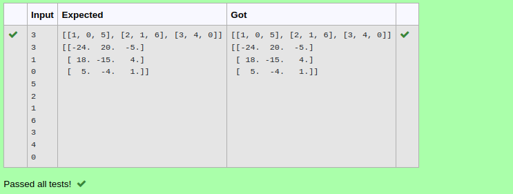

# Inverse-of-matrix

## AIM:
To write a python program to find the inverse of a matrix

## ALGORITHM:
### Step 1:
import numpy as np.
### Step 2:
Enter the input
### Step 3:
Use for loop and rang
### Step 4:
Use np.linalg.inv() to find inver of a matri
### Step 5:
print()


## PROGRAM:
```python
import numpy as np
r,c= int(input()),int(input())
l1,l2=[],[]
for i in range(r):
    for j in range(c):
        l1.append(int(input()))
    l2.append(l1)
    l1=[]
print(l2)
print(np.linalg.inv(l2))
```

## OUTPUT:


## RESULT:
